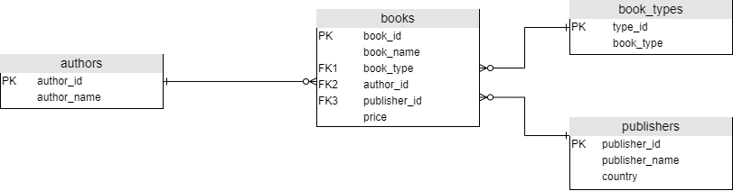
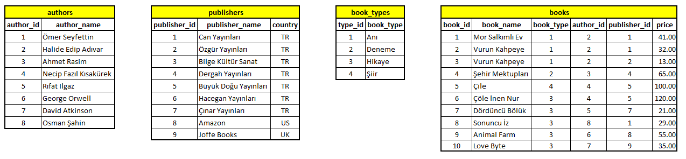

# [for SQLite BOOKSTORE.db CODE CLICK](bookstore.db-CREATE-INSERT.sql)

# CREATE
  - CREATE TABLE book_types
  - CREATE TABLE authors
  - CREATE TABLE publishers
  - CREATE TABLE books

# INSERT
  - INSERT INTO book_types
  - INSERT INTO authors
  - INSERT INTO publishers
  - INSERT INTO books

  